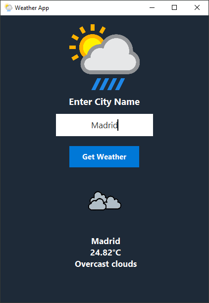

# Weather App
A **Python desktop GUI application** that shows **real-time weather** for any city using the OpenWeather API.

---

## Features
- **Real-Time Weather:** Displays temperature, condition, and location in seconds.
- **API Integration:** Uses OpenWeather API for accurate, live data.
- **Clean GUI:** Built with **Tkinter** for a smooth and lightweight interface.
- **Error Handling:** Handles network errors, missing API keys, and invalid city names gracefully.
- **Cross-Platform Ready:** Works on Windows, macOS, and Linux (Python 3+).

---

## Tech Stack
- **Language:** Python 3
- **Libraries:** Tkinter, Requests, Python-Dotenv
- **API:** OpenWeather API

---

## Screenshots


---

## Setup & Run
1. **Clone the repository:**
   ```bash
   git clone https://github.com/AyaanNadeem12/WeatherApp.git
   ```
2. **Install dependencies:**
   ```bash
   pip install -r requirements.txt
   ```
3. **Add your API Key:**
   - Create a `.env` file in the project root.
   - Add:
     ```env
     OPENWEATHER_KEY=your_api_key_here
     ```
4. **Run the app:**
   ```bash
   python main.py
   ```

---

## License
This project is licensed under the [MIT License](LICENSE).
